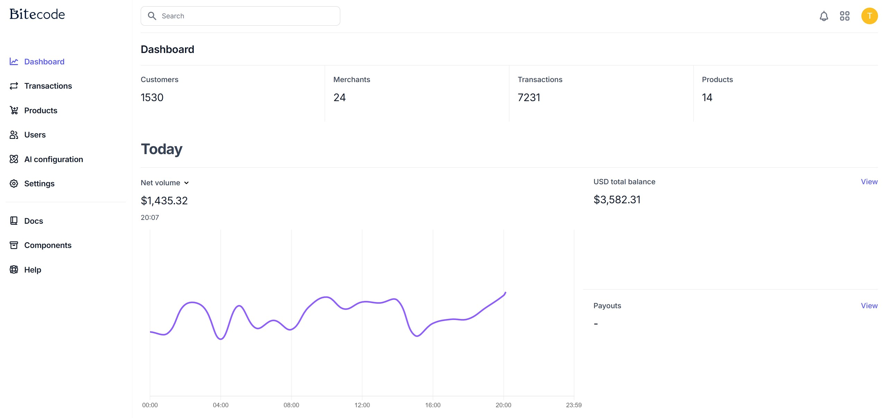
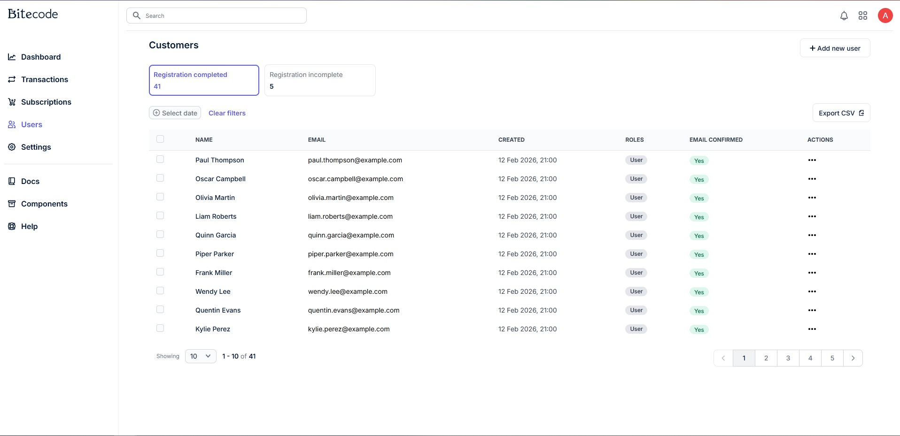
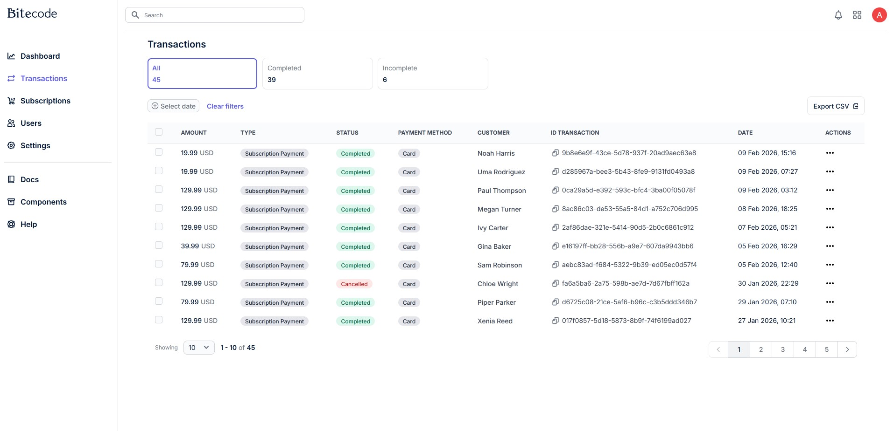
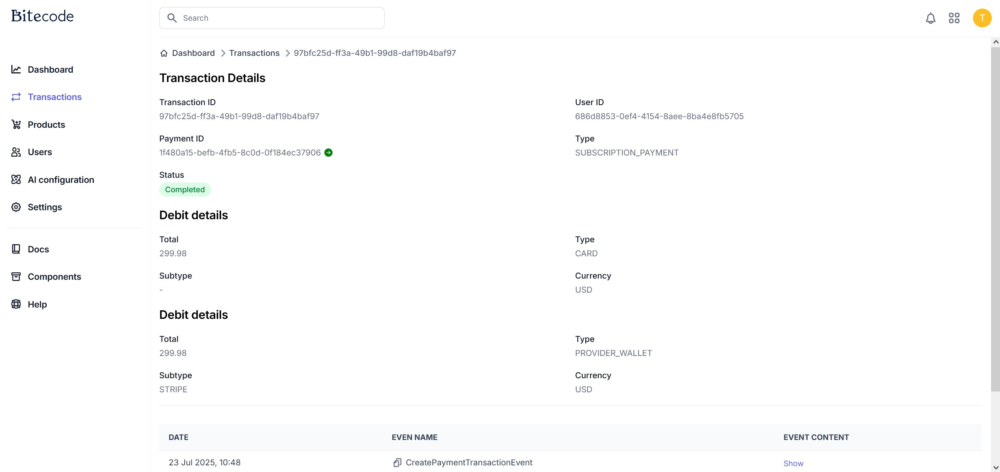
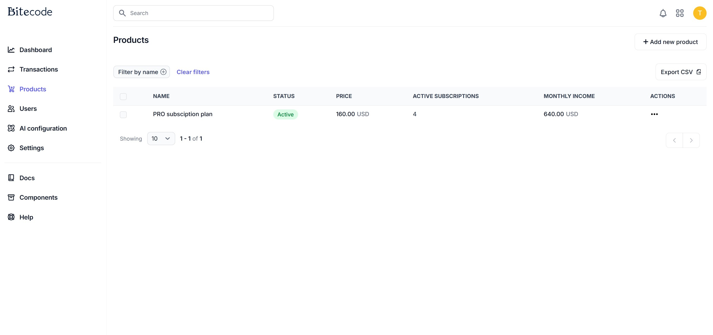
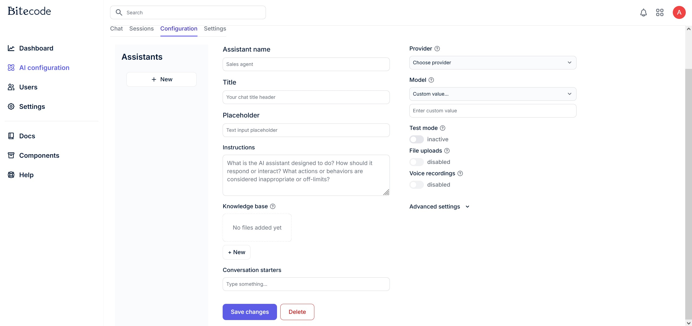
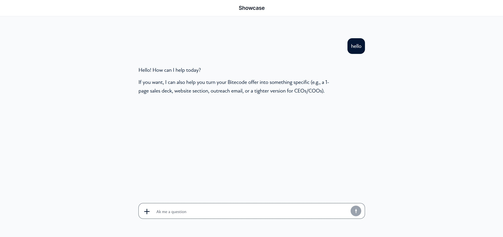

<p align="center">
  
</p>
<h1 align="center">OpenKnit</h1>

<p align="center">
  <a href="LICENSE"></a>
  <a href="CONTRIBUTING.md"></a>
  
  
  <a href="https://discord.gg/htTJuBmx"></a>
</p>

OpenKnit is a modular platform for bootstrapping production-grade systems quickly.
It ships fullstack experience built on Spring Boot and React + Vite.
You can assemble foundation of an enterprise system in minutes using domain based modules - lightweight, flexible and extensible.

## Use cases

- 🏢 Strong foundation for CRM or ERP systems that need modular domains and reliable infrastructure.
- 💳 Ideal for subscription-gated products and B2B ordering flows.
- 🚀 Well-suited for B2C products that need fast go-to-market.

## System highlights

- 🐳 One-command local environment via Docker Compose.
- 🧱 Module boundaries are strict, making future microservice extraction straightforward.
- 🧩 Start as a monolith for speed, split into microservices when needed.
- 🔐 Role-based access control with role-oriented APIs.
- 🏬 Multi-tenancy.
- 🧾 Audit events and change logs (for example, transaction event records) for traceability without full event-sourcing complexity.
- 📦 Dockerfiles included for fast deployment.
- 📱 Mobile-first UI approach for modern product experiences.
- 🤖 Designed to work well with AI-assisted development workflows.
- 🛠️ Modern enterprise stack: Spring Boot, React + Vite, and PostgreSQL (with vector support).
- 🔄 Supports event-driven communication between backend modules.
- 🧠 Clear, well-commented code with baseline flows to help developers and AI understand the system.

## Built for AI-assisted development

Modules include domain knowledge, patterns, and guidance that improve AI context and reduce mistakes.
That makes AI a safer co-pilot for extending the system without breaking boundaries or reinventing the wheel.

## Rapid bootstrap with domain and AI oriented modules

Spin up a working app fast and add only the capabilities you need (auth, payments, transactions, wallets, and more).
Each module delivers practical domain behavior and infrastructure wiring so your team can focus on product logic.

## App screenshots

<table>
  <tr>
    <td align="center">
      <a href="docs/screenshoots/Dashboard.jpg"></a><br>Dashboard
    </td>
    <td align="center">
      <a href="docs/screenshoots/users.jpg"></a><br>Users
    </td>
    <td align="center">
      <a href="docs/screenshoots/transactiions.jpg"></a><br>Transactions
    </td>
    <td align="center">
      <a href="docs/screenshoots/transaction-details.jpg"></a><br>Transaction details
    </td>
  </tr>
  <tr>
    <td align="center">
      <a href="docs/screenshoots/subscriptions.jpg"></a><br>Subscriptions
    </td>
    <td align="center">
      <a href="docs/screenshoots/ai-config.jpg"></a><br>AI config
    </td>
    <td align="center">
      <a href="docs/screenshoots/ai-assistant.jpg"></a><br>AI assistant
    </td>
    <td></td>
  </tr>
</table>

## Roadmap

1. 🏗️ Build two white-label-ready systems based on the module architecture.
2. 🤖 Focus on AI development experience with a fully agentic workflow.
3. 🧩 Continuously expand the platform with more modules.
4. ✅ Increase and maintain strong test coverage across backend and frontend modules.

## Quick start

1. Start the full dev environment with Docker Compose Watch (live sync + quick restarts):

```bash
docker compose watch
```

Backend changes trigger quick restarts inside the container, and the frontend uses Vite HMR.

Toggle demo data in your generated backend `.env`:

- `DEMO_INSERTS_ENABLED=true` to seed demo data
- `DEMO_INSERTS_USERS_PASSWORD=test123`

Backend changes trigger quick restarts inside the container, and the frontend uses Vite HMR.

2. Open the app:

- Backend: `http://localhost:8080`
- Frontend: `http://localhost:3030`

## Important Environment secrets

Backend `.env-template` (root backend):

| Variable                         | Description                      | Default              |
|----------------------------------|----------------------------------|----------------------|
| `SPRING_ACTIVE_PROFILE`          | Spring profile to run            | `LOCAL`              |
| `DEMO_INSERTS_ENABLED`           | Enable demo data seeding         | `true`               |
| `DEMO_INSERTS_USERS_PASSWORD`    | Password for demo users          | `test123`            |
| `INITIAL_INSERTS_USERS_PASSWORD` | Password for initial users       | `test123`            |
| `BITECODE_JWT_SECRET_KEY`        | JWT secret                       | <randomly generated> |
| `SPRING_DATASOURCE_USERNAME`     | DB username                      | `test`               |
| `SPRING_DATASOURCE_PASSWORD`     | DB password                      | `test`               |
| `FLYWAY_SEED_DATA`               | Seed additional data with Flyway | `false`              |_

_
Frontend `.env-template` (root frontend):

| Variable           | Description      | Default                 |
|--------------------|------------------|-------------------------|
| `VITE_BACKEND_URL` | Backend base URL | `http://localhost:8080` |

Each backend module can also expose its own `.env-template` (for
example: `backend/modules/identity/.env-template`, `backend/modules/payment/.env-template`, `backend/modules/ai/.env-template`).

## Demo users

Default demo users are created from `backend/modules/_common/src/main/resources/demo-inserts/user-email-reference.sql`.
The default demo password is `test123` (controlled by `DEMO_INSERTS_USERS_PASSWORD`).

| Email                         | Password  |
|-------------------------------|-----------|
| `admin@bitecode.tech`         | `test123` |
| `frank.miller@example.com`    | `test123` |
| `grace.wilson@example.com`    | `test123` |
| `henry.moore@example.com`     | `test123` |
| `isabella.taylor@example.com` | `test123` |

Note: `admin@admin.com` exists only in test fixtures (`backend/modules/_common/src/test/java/bitecode/modules/_common/utils/TestDataFactory.java`).
